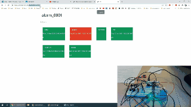

# kernel-driver-web-alarm
The system uses sensors to monitor the movement in the  entrances and windows of the house, alarming the owner via text or email if the alarm had been  triggered. In order to create the most secure home alarm, consideration has been given not only to  protecting the home against physical attack

Elements such as an LED, button, door jumper, motion sensor, buzzer and photoresistor were 
connected to Raspberry Pi using GPIO pins(Figure 1). The driver was developed to listen to the 
hardware for interrupts that invoke specific actions associated with changing the alarm state. The 
module waits for the events and writes information about them the userspace simultaneously 
changing states and performing actions related to it, such as triggering or arming the alarm. Driver is 
char type driver that acts like a file to which driver write data that client application can read and 
process further. To prevent excessive pulling of data to the file, a queue was used to awake writing 
data only during the event. When the alarm is activated, the driver controls the LED and the buzzer 
alternately turns it on and off using a timer. Checking the current state or controlling the device is 
carried out in use of commands based on the module performs specific actions. Commands have no 
physical effect on the state of the system elements, just the ability to change the overall state of the 
system or obtain its current state if it is not known to the user. The alarm is not only able to change 
its activation state but also its armed state when the brightness level in the area drops. 

The kernel driver also uses a timer that allows you to control the LED and buzzer, changing their 
state to the opposite for each operation. Each of the sensors has a registered handler intrupts, which 
during startup performs operations according to the sensor's task. The photoresistor required 
ignoring some of the interrupts due to its extended triggering at the edge of the high and low 
voltages. 
Client application forwards driver events to the MQTT broker, depending on its type, by publishes it 
to the indicated topics and responding on external requests. Messages with events are attaching 
with timestamp prepared to transportation by wrapping them to the JSON format. For every event 
message coming from a broker, the client validates the type of event and sends back incoming 
command to the device. 

The configuration of the database and MQTT was based on the appropriate configuration files 
located on the connected volumes, and in the case of MongoDB to run the script that creates the 
appropriate structure of collections and users. Cone of the servers in production are exposed to the 
port 22, and all data exchange takes place by inserting the code on the appropriate EFS volumes 
using a temporary virtual machine

Like a broker, the website and database have been additionally secured with credentials requiring 
authentication from the user. All external services (Figure 3) run on amazon cloud on a dedicated 
cluster through the Elastic Container Service being encapsulated in containers. Due to limitations to 
comuninicate between containers and bridge network containers has been used with elastic IP and 
external domain. The use of Dockers allowed for easier local work in the test 
environment, also for better control of port exposure, data volumes, or adjustment of the relevant 
resources and software versions. The web application and the database also have access to the 
Elastic File System where they can exchange data via shared volumes, especially certificates. 
The application, as the client, listens for messages from the MQTT broker using them real-time also 
saving data to a database as history logs and access point to previous data (if user connects till after 
latest events arrived). By recording earlier events in the database, the user can see the history of 
events in the form of a list and can be used in future development. 

Initially, when the website starts running, send information into MQTT for finding connected devices 
to listen. Listening to the MQTT server takes place only during the operation of the server, which can 
react to certain events. All incoming messages blink as red for a while(Figure 4). It has been possible 
to develop modules for sending emails and text messages, but it has not been possible to implement 
the whole solution of sending notifications about the occurrence of alarm releases in time. 
On each user, request sewer sends commands to client applications via MQTT to get current 
information about alarm devices in real-time or take some data stored already in the database. 
Communication with the client side has been handled using web sockets, giving users a nice view 
and consistent real-time data without reloading the website. Data from MQTT are processed and 
passed to web sockets where are presented. User can also disable alarm using his credentials and 
password to defuse alarms. 

# Overview
## AWS Cluster

## Sensors

## Unarm

